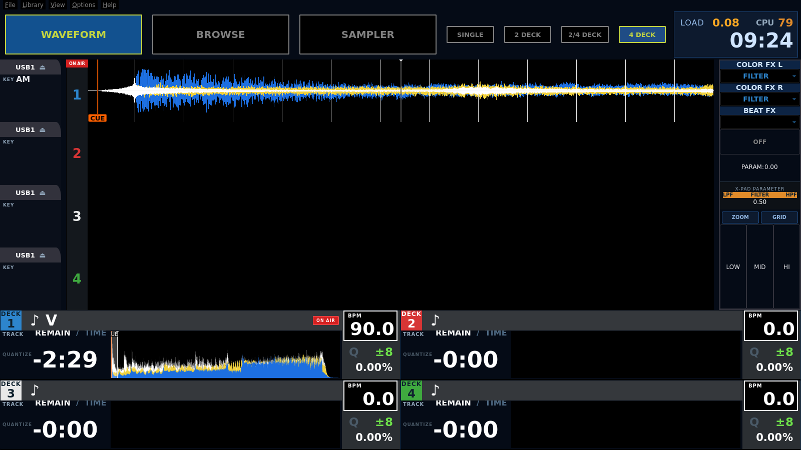

# Pioneered by ntamas

Mixxx 2.5 skin és Raspberry Pi 4 DJ-doboz eszközkészlet, amely a Pioneer
XDJ-XZ / XDJ-AZ WAVEFORM képernyőjét közelíti — DDJ-1000 kontrollerhez.

A skin a [Pioneered](https://github.com/timewasternl/Pioneered) /
[Pioneered-Plus](https://github.com/bencejuhaasz/Pioneered-Plus) 4 deckes
változatára épül (GPL-3.0).



## Mit tud

- XZ-stílusú deck kártyák: DECK badge csatornaszínnel, REMAIN/TIME (kétállású,
  érintésre vált), egyoldalas kék/sárga/fehér hullámforma, BPM doboz MASTER
  chippel, Q / ±tartomány / tempó% panel, TRACK + QUANTIZE lámpa
- `2 DECK | 2/4 DECK | 4 DECK` nézetváltó — az aktív gomb újranyomása a
  deck-párok (1-2 ↔ 3-4) között vált
- Waveform oldalsáv: USB1 + eject, KEY, ON AIR oszlop nagy deck számmal
- Pioneer-módra ciklikus ZOOM (befelé nagyít, a végén visszaugrik), mind a
  4 decken egyszerre
- CPU kijelző a felső sávban (systemd daemon → VirMIDI → mapping → skin)
- SINGLE/CONTINUE (AutoDJ), X-PAD sáv, ZOOM/GRID, LOW/MID/HI kill
- Idő-vonalzó a kártya hullámformája alatt (`-4:00 -3:00 …`) — ehhez a
  `pi-setup/build-mixxx-ruler.sh` által fordított patchelt Mixxx kell

## Felépítés

| Út | Mi ez |
|---|---|
| `skin/Pioneered_by_ntamas/` | a kész skin — másold a `~/.mixxx/skins/` alá |
| `patch-skin-xz.py` | idempotens építő: a `Pioneered_4_deck` bázisból állítja elő a skint lépésenként |
| `controllers/Time-Clamp.midi.xml` + `-scripts.js` | VirMIDI-re akasztott mapping: kétállású idő, nézetváltó rádió, ciklikus zoom, CPU fogadás — kontroller nélkül is betöltődik |
| `controllers/pioneer-ddj1000.midi.xml` + JS | saját 4 deckes DDJ-1000 mapping (351 vezérlő, 56 kimenet), a hivatalos AlphaTheta MIDI listából generálva |
| `controllers/gen_mapping.py` | a DDJ-1000 XML generálója |
| `pi-setup/` | Pi 4 provisioning: headless boot, audit, CPU→MIDI daemon, conky overlay, Mixxx forrásfordítás az idő-vonalzó patch-csel |

## Pi gyorstelepítés

```bash
# a Pi-n:
sudo modprobe snd-virmidi && echo snd-virmidi | sudo tee /etc/modules-load.d/virmidi.conf
cp -r skin/Pioneered_by_ntamas ~/.mixxx/skins/
cp controllers/Time-Clamp* ~/.mixxx/controllers/
sudo install -m755 pi-setup/djbox-cpu-midi.sh /usr/local/bin/
# mixxx.cfg: [Controller] VirMIDI_3-0 1, [ControllerPreset] VirMIDI_3-0 Time-Clamp.midi.xml
```

Ajánlott `mixxx.cfg` értékek: `WaveformType 19` (all-shader Filtered, a skin
színeivel), `WaveformOverviewType 0`, `TimeFormat 1`, `PositionDisplay 1`.

## Miért így

- `[Controls],PositionDisplay` csak konfig-kulcs, az élő vezérlő a
  `ShowDurationRemaining` — és a 3 állapotú körforgás a `WNumberPos`-ban van
  bedrótozva, ezért a kétállású időhöz szkript kell.
- A `WPushButton` csak `ControlPushButton`-on vált, sima `ControlObject`-en
  PUSH-ba esik — ezért mennek a nézetváltó gombok momentán triggerrel és
  külön display-vezérlővel.
- A Qt a `min-width`-et a tartalomra érti, a padding/border rájön — fix
  szélesség helyett az oszlop méretez.

GPL-3.0, a bázis skin licencét örökli.
