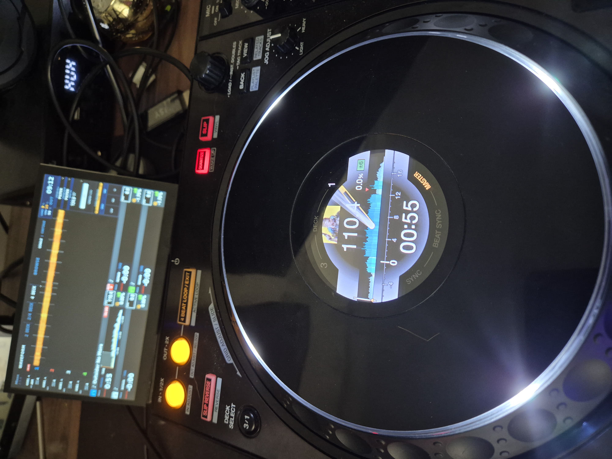
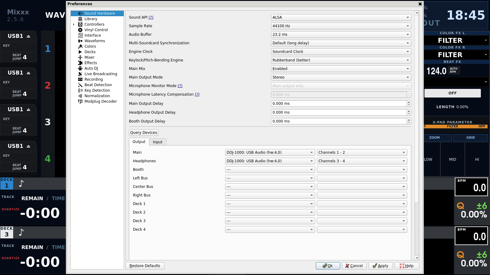
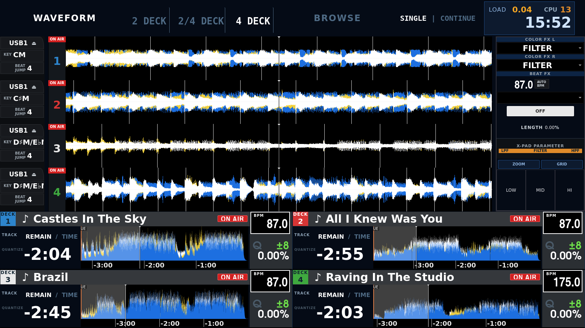
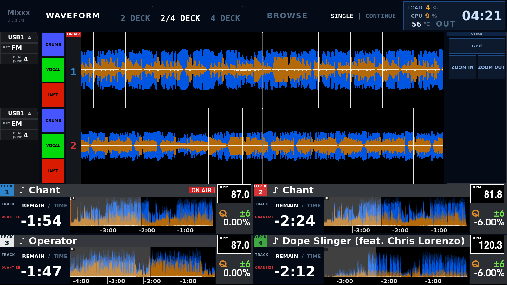
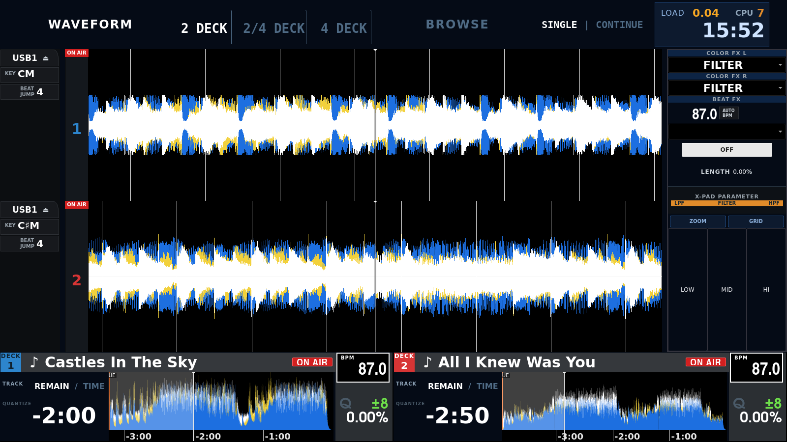
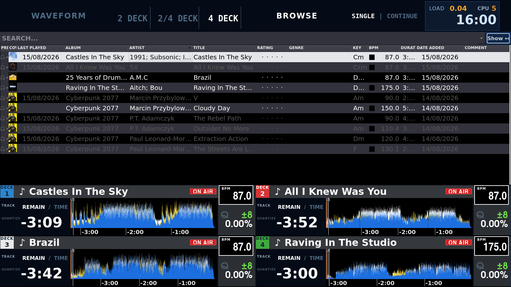

<p align="center"></p>

# Pioneered by ntamas


Mixxx 2.5 skin and Raspberry Pi 4 DJ-box toolkit that recreates the Pioneer
XDJ-XZ / XDJ-AZ WAVEFORM screen — built for the DDJ-1000 controller.

The skin is based on the 4-deck variant of
[Pioneered](https://github.com/timewasternl/Pioneered) /
[Pioneered-Plus](https://github.com/bencejuhaasz/Pioneered-Plus) (GPL-3.0).

**Fastest start:** grab a ready-to-boot SD-card image from the
[latest release](https://github.com/ntamas94/pioneered-by-ntamas/releases)
(~1.1 GB `.img.xz`, Mixxx 2.5.6), flash it with Raspberry Pi Imager or
balenaEtcher onto a 16 GB+ card, add your WiFi to `network-config` on the
boot partition (or use ethernet) and power up — it boots straight into Mixxx.
Login `dj` / `pioneered`, SSH enabled.

Two flavours: **full** (4-deck UI with the `2 DECK / 2/4 DECK / 4 DECK`
selector, auto deck-profile) and **2deck** (pinned to the 2 DECK view — for
DDJ-FLX4 / DDJ-400 / DDJ-200 / SB3 / REV1 class controllers). The profile
is one word in `/etc/djbox-profile` (`full`, `2deck`, `auto`), change it any
time.

Hardware: **Raspberry Pi 4, 2 GB RAM minimum, 4 GB recommended.** A Pi 3
will boot it but 1 GB RAM and the VC4 GPU make it a poor DJ experience. The
images ship stock clocks; with active cooling `arm_freq=2000` /
`over_voltage=6` in `config.txt` is a free ~10% (the reference box runs 2 GHz
at ~35 °C under load with a fan).

## The DDJ-1000 on a Raspberry Pi 4

<p align="center"></p>

That is a DDJ-1000 jog wheel running from Mixxx on a Raspberry Pi: cover art,
the track's waveform coloured by density, the beat scale with its markers, BPM,
the playing speed and its range, the time, and MASTER lit on the deck that has
the sync lead. The needle tracks the music. **No DJ software on Linux drives
these screens**, and Pioneer documents none of it — it was worked out by
capturing rekordbox on Windows, capturing this stack on Linux, and comparing
the two byte for byte.

### Where it stands

Working, and measured rather than assumed:

- **Sound.** 44.1 kHz 24-bit, six channels out and twelve in — the asymmetry is
  real, and getting it wrong cost a standing −2268 ppm clock error. Master on
  channels 1-2, headphones on 3-4.
- **The screens.** Artwork, waveform, beat grid, hot cues and saved loops, key,
  tempo, the playhead, the loop length, on-air, SYNC and MASTER, and the
  end-of-track flash — which is two speeds, not one.
- **Plug and play.** The daemon is bound to the controller's own device unit,
  so it starts when the DDJ is plugged in and stops when it is pulled out.
  Nothing to enable, nothing to start by hand.
- **Controls.** A four-deck mapping, jog scratching with real platter physics,
  the pads, the mixer, browse.

Set the sound output like this — and set **Headphones** as well as Main, or the
CUE buttons do nothing at all, silently:

<p align="center"></p>

What is not wired yet is written down in
[`ddj1000-linux/ROADMAP.md`](ddj1000-linux/ROADMAP.md), read out of Pioneer's
own List of MIDI Messages: two pad modes still dark, the effect section's lamps,
and a handful of bugs worth fixing first.

Install with [`ddj1000-linux/install.sh`](ddj1000-linux/) — the kernel quirk,
the daemon and the mapping, each usable on its own. The quirk on its own, as a
patch against the kernel tree, is in [`ddj1000-audio/`](ddj1000-audio/).

## Screen modes

All four decks loaded and on air:

| 4 DECK | 2/4 DECK |
|---|---|
|  |  |

| 2 DECK | BROWSE |
|---|---|
|  |  |

- **2 DECK** — two full-height scrolling waveforms (each ~35% of the screen)
  plus one row of large deck cards, flush with the bottom edge
- **2/4 DECK** — two waveforms, all four deck cards
- **4 DECK** — four waveforms, four cards
- **BROWSE** — library table (plugged-in USB drives appear under
  *Computer → Removable Devices* and as a Quick Link) with the same deck
  cards, overview waveform and minute ruler included

## Features

- XZ-style deck cards: DECK badge in channel colour, REMAIN/TIME (two-state,
  tap to toggle — **independently per deck** with the patched build),
  one-sided blue/yellow/white overview waveform, BPM box with
  MASTER chip, Q / range / tempo% panel, TRACK number with QUANTIZE lamp
- On-screen keyboard for touch use: dark full-size layout (onboard, Droid
  theme) drawn as an overlay over the deck-card strip — Mixxx itself is
  never resized. Toggled with the KBD button next to the search box, and it
  pops up Android-style whenever the search box gets focus (patched build)
- `2 DECK | 2/4 DECK | 4 DECK` view selector — pressing the active button
  again flips between deck pairs (1-2 ↔ 3-4)
- Waveform sidebar: USB1 + eject, KEY, ON AIR column with large deck number
- ZOOM IN / ZOOM OUT step all four decks together along a fixed ladder,
  and GRID puts all four back to the default zoom
- Three stem buttons in every waveform lane, DRUMS / VOCAL / INST in
  rekordbox's own colours, wired to `[Pioneered],stem<N>_*`
- Top status box: LOAD (audio engine %), CPU %, SoC °C, clock, and an
  `OUT` button that flips the master output between HDMI and the 3.5 mm
  jack (`pi-setup/djbox-audio.sh hdmi|jack|usb`). HDMI on the Pi only takes
  IEC958-framed audio, so a raw `hw:` open fails in Mixxx — the script sets
  up a named ALSA plug device (`hdmi_out`) that PortAudio lists and Mixxx
  can pick; a USB sound card is picked up by `usb`
- SINGLE/CONTINUE (AutoDJ)
- Minute ruler under the card waveform (`-4:00 -3:00 …`) — requires the
  patched Mixxx built by `pi-setup/build-mixxx-ruler.sh`
- Whole deck card is a track drop target; with the patched build the card
  lights up while a drag hovers over it, and long titles scroll (marquee)
  instead of pushing the layout apart

## Layout

| Path | What it is |
|---|---|
| `skin/Pioneered_by_ntamas/` | the finished skin — copy into `~/.mixxx/skins/` |
| [`docs/the-skin.md`](docs/the-skin.md) | what each skin file draws, the `[Pioneered]` control namespace and who is on each end of it, the deck and time modes, and the waveform palette |
| `patch-skin-xz.py` | idempotent builder: produces the skin from the `Pioneered_4_deck` base, step by step |
| `controllers/Time-Clamp.midi.xml` + `-scripts.js` | mapping attached to a VirMIDI port: two-state time, view-selector radio, cyclic zoom, CPU input, plus play (CC `0x11-0x14`) and LoadSelectedTrack (CC `0x15-0x18`) bindings for decks 1-4 so the box can be driven headless via `amidi` — loads without any hardware controller |
| `controllers/pioneer-ddj1000.midi.xml` + JS | custom 4-deck DDJ-1000 mapping (351 controls, 56 outputs), generated from the official AlphaTheta MIDI list |
| `controllers/gen_mapping.py` | the DDJ-1000 XML generator |
| `pi-setup/` | Pi 4 provisioning: headless boot, audit, CPU→MIDI daemon, on-screen keyboard daemon (`djbox-osk-*`), conky overlay, patched Mixxx source build, `pioneered-mixxx.patch` |

## Quick install on the Pi

```bash
# on the Pi:
echo 'options snd-virmidi index=5' | sudo tee /etc/modprobe.d/virmidi.conf
echo snd-virmidi | sudo tee /etc/modules-load.d/virmidi.conf
sudo modprobe snd-virmidi
cp -r skin/Pioneered_by_ntamas ~/.mixxx/skins/
cp controllers/Time-Clamp* ~/.mixxx/controllers/
sudo install -m755 pi-setup/djbox-cpu-midi.sh /usr/local/bin/
# mixxx.cfg: [Controller] VirMIDI_5-0 1, [ControllerPreset] VirMIDI_5-0 Time-Clamp.midi.xml
```

Recommended `mixxx.cfg` values: `WaveformType 19` and `WaveformOverviewType 0`
on a stock Mixxx, which are the filtered renderers the skin's palette is tuned
for; `17` and `2`, the RGB pair, once the three-band build below is installed
and the mix stops normalising itself. [`docs/the-skin.md`](docs/the-skin.md)
has the measurements. Also `TimeFormat 1`, `PositionDisplay 1`.

## Patched Mixxx

The `.deb` packages attached to the Release (arm64, Debian Trixie /
Raspberry Pi OS) add these on top of upstream 2.5.6, packaged with Debian's
own `debian/` directory (`pi-setup/pioneered-mixxx.patch` is the diff for
the first six):

- minute ruler under the card overview waveform (`-4:00 -3:00 …`)
- `dropHover` property on `TrackWidgetGroup` — the skin highlights the card
  a track is about to be dropped onto
- `<Elide>scroll</Elide>` in WLabel: long titles bounce left-right instead
  of stretching the layout
- staggered waveform resize in `WWaveformViewer` — works around a v3d GPU
  hang (endless "Resetting GPU for hang") when several GL waveforms resize
  at once during 2↔4 deck switches
- `<ModeConfigKey>` on `NumberPos` — the time display can follow a
  per-deck control instead of the global `ShowDurationRemaining`, giving
  each deck card its own two-state REMAIN/TIME toggle
- search box focus drives `[Pioneered],osk_req` — the on-screen keyboard
  appears while the search box has focus
- the three-band waveform mix moved out of the binary and into the skin
  (`pi-setup/build-mixxx-3band.sh`)

Mixxx and rekordbox draw a three-band waveform the same way in outline: split
the track at two crossovers, keep one level per band per column, mix three
colours by those levels. Picking the three colours in the skin therefore gets
the hues right and the character wrong, because the character is not in the
colours. Mixxx splits at 600 Hz and 4 kHz with fourth-order Bessel filters,
and then, in `WaveformRendererRGB` and in `WOverview::drawNextPixmapPartRGB`,
divides the mixed colour by its own largest component. That throws the level
away and keeps only the ratio: a column ten decibels down is drawn as bright
as the loudest one in the track, and nothing is ever white, because white
needs all three components at once and only the largest survives. rekordbox
adds without that step, which is why its quiet passages stay dark and its
dense ones go white.

The patch does not swap one hard-coded rule for another. It gives both
renderers one shared mixer whose numbers — the three base colours, a gain and
a curve per band, the choice between `normalized`, `additive` and `preserve`,
and where the column height comes from — are read out of the skin's
signal-colour block, with defaults that reproduce today's Mixxx exactly. The
band levels arrive as the bytes the analyzer stored, so gain and curve are
256-entry tables built at skin load rather than `pow()` in the per-pixel loop.
The crossovers are left where they are until rekordbox's own are measured;
moving them means re-analysing every track, so the script does that only when
asked and bumps the stored-waveform version string when it does.

Install: `sudo dpkg -i mixxx-data_*.deb mixxx_*.deb`. A clean build on a Pi 4
is hours, so the later scripts stack on the tree the earlier ones left behind
instead of each starting from scratch: `build-mixxx-ruler.sh` is the one that
fetches source and builds from nothing, against Debian's 2.5.0; the 2.5.6
tree the shipped packages come from was made by copying that `debian/`
directory onto the upstream 2.5.6 tarball, turning `BUILD_BENCH` and
`ENGINEPRIME` off in `debian/rules` and applying `pioneered-mixxx.patch`, and
`build-mixxx-3band.sh` patches that tree in place. The version string sorts
above the distro package, so `apt upgrade` will not replace it.

## Why it is built this way

- `[Controls],PositionDisplay` is only a config-file key; the live control is
  `ShowDurationRemaining` — and the 3-state cycle is hard-coded in
  `WNumberPos`, which is why the two-state time needs a controller script.
- `WPushButton` only toggles on a `ControlPushButton`; on a plain
  `ControlObject` it falls back to PUSH — hence the view-selector buttons use
  momentary triggers plus separate display controls.
- Qt applies `min-width` to the content box, padding/border comes on top —
  the column sizes the boxes instead of fixed widths.

## Licensing

Three separately licensed works live here, each under the licence its origin
imposes. That is aggregation, not one combined work — nothing here links the
kernel module to the skin.

| Part | Derived from | Licence |
|---|---|---|
| `skin/`, `patch-skin-xz.py`, `controllers/`, `pi-setup/` | [Pioneered](https://github.com/timewasternl/Pioneered) / [Pioneered-Plus](https://github.com/bencejuhaasz/Pioneered-Plus) | **GPL-3.0** ([LICENSE](LICENSE)) |
| `ddj1000-linux/audio/`, `ddj1000-audio/` | the kernel's `snd-usb-audio` | **GPL-2.0-only** ([LICENSE](ddj1000-linux/audio/LICENSE)) |
| `pi-setup/pioneered-mixxx.patch` | [Mixxx](https://github.com/mixxxdj/mixxx) | **GPL-2.0-or-later** |

The audio trees cannot be relicensed to GPL-3.0: 24 of their files carry
`SPDX-License-Identifier: GPL-2.0`, which is GPL-2.0-*only*. The skin cannot be
relicensed to GPL-2.0 either, since Pioneered is GPL-3.0. Keep them apart.

Shipping a built kernel module — a `.deb`, a `.ko`, an SD-card image — means
offering the matching source to whoever receives it.

The DDJ-1000 Linux work continues in its own repository; the copy under
`ddj1000-linux/` here is a snapshot and does not track it.
